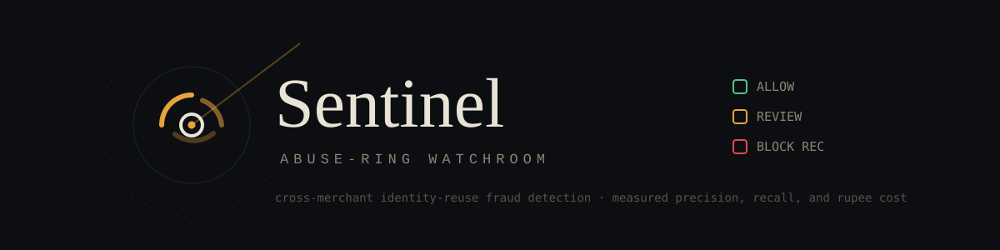
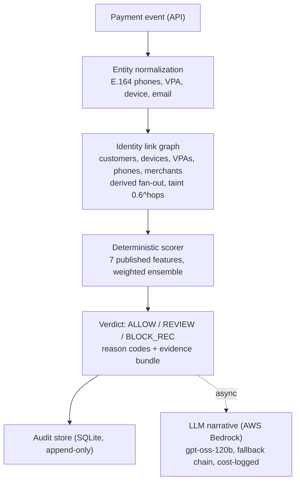
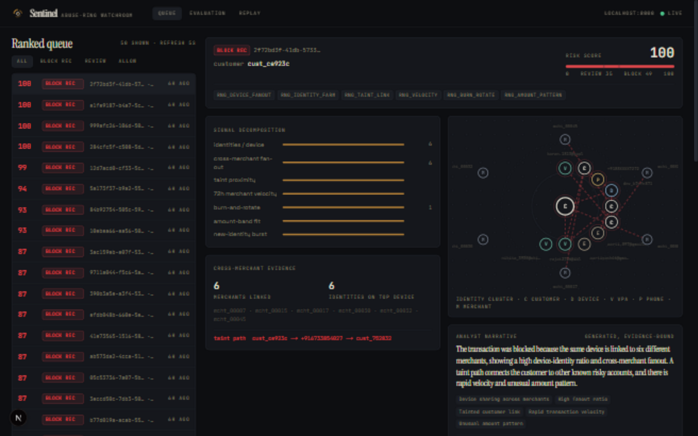
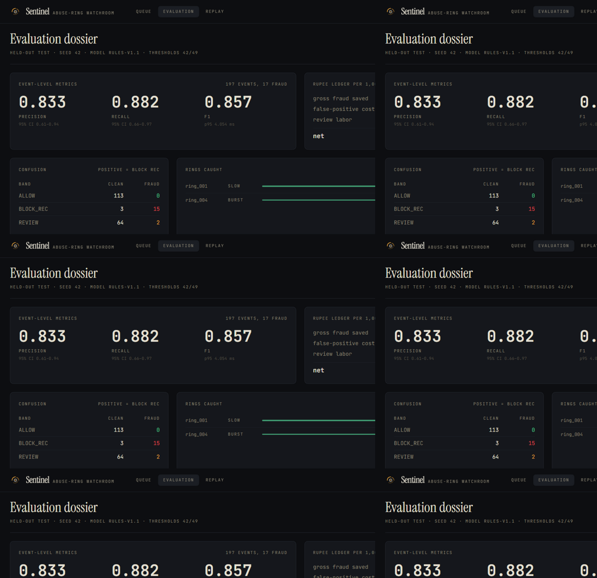
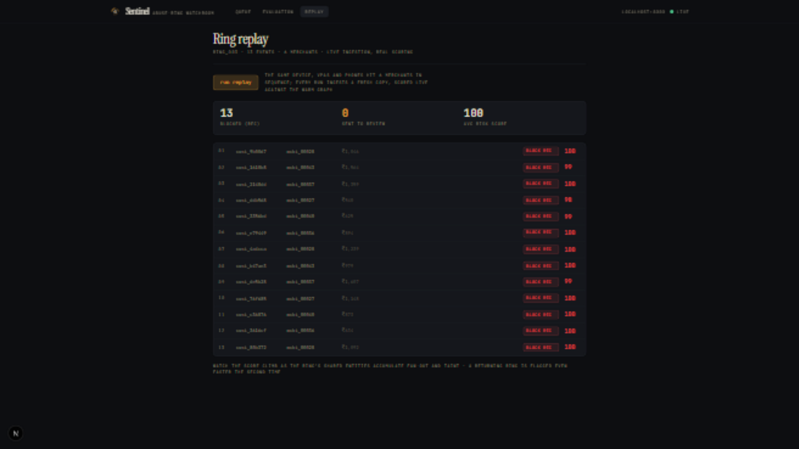

<p align="center">
  
</p>

<p align="center">
  <strong>Defense-only fraud detection for cross-merchant identity reuse.</strong><br>
  Catches the same UPI ID, phone number, or device fingerprint being recycled across merchants,
  with explainable verdicts and honestly measured precision, recall, and false-positive cost in rupees.
</p>

<p align="center">
  
  
  
  
</p>

---

Fraud rings in Indian digital payments do not invent new identities, they **recycle** them: the same device, VPA, and phone hit merchant after merchant until each one individually blocks them. Every merchant sees a clean first-time customer; the fraud only exists *between* merchants. Sentinel builds the identity link graph across the whole population, scores every payment event against it deterministically, and hands the analyst an evidence bundle, not a black-box number.

> Razorpay AI Buildathon, Track 02 (AI Risk Manager). The system recommends, never acts: no autonomous blocking, no money movement, strictly defense-only.

## Measured results (held-out test set, seed 42, single pass)

| Metric | Value |
|--------|-------|
| Precision (positive = BLOCK_REC) | **0.833** (95% CI 0.586, 0.946) |
| Recall (event level) | **0.882** (95% CI 0.622, 0.966) |
| F1 | **0.857** |
| Rings caught | **2 of 2**, including the sophisticated low-and-slow ring |
| Fraud silently allowed | **0** (the two unblocked frauds sit in the REVIEW abstention queue) |
| Net saving after FP and review cost | **+₹38,665 per 1,000 events** (gross ₹83,756, FP cost ₹4,888, review ₹40,203) |
| Scoring latency | p50 **2.3 ms** / p95 **4.1 ms** (design target was 20 ms) |
| Total LLM spend across the entire build | **under $0.10** |

### Honest disclosures, in the open

- **A GBDT baseline edges the rule ensemble on F1** (0.909 vs 0.857) on identical features and splits. We report it, not bury it: the deterministic scorer keeps the explainability and audit contract a money-adjacent system requires, and this result is the measured argument for the v2 hybrid.
- **The adversarial evasion pack found a real blind spot:** slow-rate rings (one event per week) evade the current weights, documented with the v2 fix (time-windowed fan-out) instead of silently retuning on evaluation data.
- Every number regenerates from `make calibrate && make evaluate` on a fixed seed, with byte-identical `metrics.json` across runs.

## How it works



Two principles hold end to end: **the LLM never scores** (scoring is deterministic, seed-reproducible, fully attributable; the LLM only turns evidence into an analyst-facing narrative), and **every failure degrades explicitly** (store down means spool-and-503, LLM down means `SKIPPED`; the system never crashes and never silently auto-blocks).

## Quick start

```bash
make setup        # Python 3.12 venv, pinned deps, git hooks
make check        # ruff + mypy strict + pytest with 90% coverage gate
make evaluate     # calibrates on first run, then: held-out metrics + report
make backfill     # seed 1,000 verdicts + top-20 LLM narratives (bounded spend)
make serve        # API on http://localhost:8000  (OpenAPI docs at /docs)
make console-setup && make console   # analyst console on http://localhost:3000
```

AWS credentials come only from the default credential chain (needed for the Bedrock narrative step and `make models`); everything else runs offline.

<details>
<summary><strong>No <code>make</code> on Windows?</strong> Run the same steps directly</summary>

```bat
py -3.12 -m venv .venv
.venv\Scripts\python -m pip install --upgrade pip
.venv\Scripts\python -m pip install -r requirements.txt
.venv\Scripts\python -m pip install -e . --no-deps
.venv\Scripts\python -m pytest -m "not slow and not bedrock"
.venv\Scripts\python -m sentinel.calibrate
.venv\Scripts\python -m sentinel.evaluate
```

</details>

### The analyst console

| Queue and evidence | Evaluation dossier | Ring replay |
|---------------------|--------------------|-------------|
|  |  |  |

Ranked verdicts with a live evidence panel (signal decomposition, cross-merchant links, taint path, the hand-drawn radial cluster graph, and the LLM narrative), the full evaluation dossier, and a scripted replay where a ring's scores climb 23 to 82 as it spreads across six merchants. For a fresh replay experience, delete `sentinel.db*` before `make serve`. The console is a hand-built design system, the watchroom: warm dark ink, radar-amber accent, verdict triad colors, three type voices, custom logo and favicon, no template UI.

## API surface

| Endpoint | Scope | Purpose |
|----------|-------|---------|
| `POST /v1/events`, `POST /v1/events:batch` | standard | ingest and score (idempotent; duplicates return the prior verdict) |
| `GET /v1/verdicts/{id}`, `GET /v1/verdicts?verdict=&limit=` | standard | verdict payloads and the ranked queue |
| `GET /v1/risk/entities/{type}/{value}` | standard | **federated aggregates only** (counts, fan-out, taint, recency) |
| `GET /v1/risk/entities/{type}/{value}/full` | admin | raw cross-merchant listing, audit-logged |
| `GET /v1/graph/cluster/{customer_id}` | standard | cluster view; phones masked (`+9198XXXX5678`) |
| `GET /v1/graph/cluster/{id}?unmask=true` | admin | unmasked view, audit-logged |
| `POST /v1/feedback` | standard | append-only analyst decisions |
| `GET /v1/evaluation`, `GET /v1/demo/scenario` | standard | evaluation artifacts, scripted demo |
| `GET /healthz`, `GET /readyz` | none | liveness and readiness |

Two-key model throughout: a standard key for analyst views and a separate admin key for anything exposing raw identities, with every privileged action written to the audit store under a scope label (never the key value).

## Security and defense-only posture

- No real PII anywhere: all data is synthetic by construction, and labels never cross the serving boundary.
- AWS keys are never in code, env files, or the repo; gitleaks scans full history on every push; CI never makes a paid call.
- Bounded LLM budgets: botocore retries disabled, a single retry on malformed JSON only, every call cost-logged, live tests gated behind a manual marker.
- Verdicts are recommendations. `BLOCK_REC` explicitly means a human decides.

## What broke (and how it got fixed)

The full log lives in [`docs/what-broke.md`](docs/what-broke.md), twenty genuine entries appended in real time, never invented after the fact. A taste: the first calibration inflated the weakest feature to weight 32 by exploiting the synthetic amount distribution (fixed with a published feature-prior cap), the first split assignment starved the test set of fraud entirely (the greedy filler had lost its count update), and a merchant-traversal bug diluted every identity cluster until merchants became non-traversable leaves.

## Documentation and repository

The complete design suite (problem and loss model, architecture, data design, ML and evaluation protocol with the rupee cost model, API specification, security and DPDP/PCI alignment, and the phase-gated roadmap) is in [`docs/`](docs/README.md).

```
src/sentinel/    detection engine: normalization, identity graph, features,
                 scorer, verdicts, calibration, evaluation, LLM layer,
                 FastAPI service, SQLite audit store
console/         Next.js analyst console (the watchroom design system)
tests/           160 tests, 91% coverage, strict mypy, CI-gated
docs/            design suite, what-broke log, screenshots, banner
.github/         CI: lint, strict types, coverage gate, secret scan
scripts/         bounded Bedrock verification, git hooks
```

## License

MIT. See [LICENSE](LICENSE).
