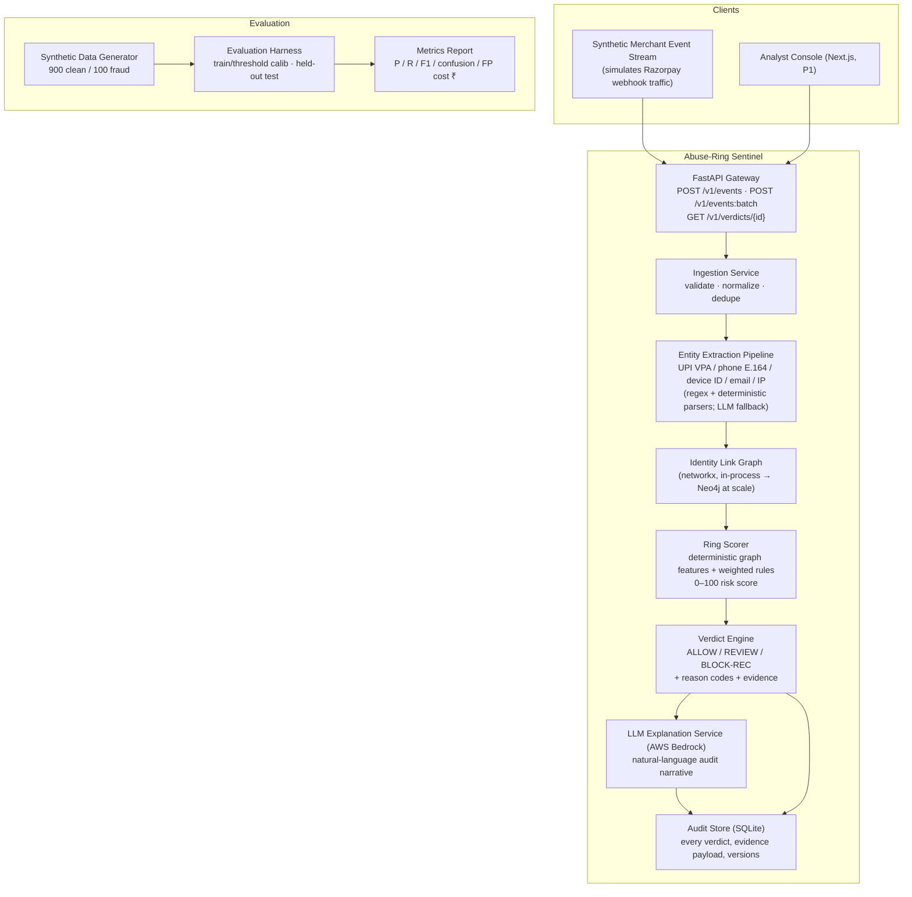
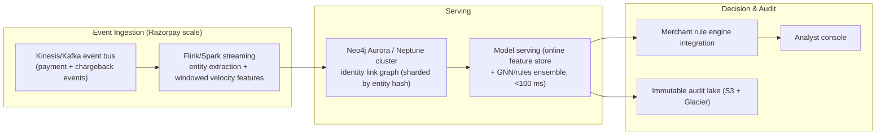

# 03: System Architecture

## Problem Statement (restated)

Detect the same UPI ID, phone number, or device fingerprint being reused across multiple merchants/customers to commit fraud, and produce an explainable, bounded risk verdict with honestly measured precision, recall, and false-positive cost, defense-only.

## High-Level Architecture



## Data Flow (walkthrough of one event)

1. **Ingest**: `POST /v1/events` receives a payment event: `{event_id, merchant_id, customer_id, amount_paise, upi_vpa?, phone?, device_id?, email?, ip?, ts, prior_outcome?}`. Validate schema (Pydantic); reject malformed with a 4xx and a machine-readable error.
2. **Normalize & Extract**: deterministic parsers normalize entities: phone → E.164, VPA → lowercase `handle@pvp`, device ID → trimmed hash form. LLM is **not** used here in the hot path (regex is faster, free, deterministic); an LLM-assist path exists only for messy free-text fields in batch backfill.
3. **Graph Update**: upsert nodes (`Customer`, `UPI`, `Phone`, `Device`, `Email`, `Merchant`) and edges (`PAYS_WITH`, `CONTACT_OF`, `SEEN_ON`, `PURCHASES_AT`). Edge attributes carry first_seen/last_seen/count.
4. **Score (deterministic)**: for the touched identity cluster, compute graph features (see doc 05): cross-merchant fan-out of each entity, device-to-identity ratio, taint propagation from confirmed-fraud nodes, velocity in sliding window, burn-rotate pattern. Weighted rule ensemble → 0–100 score. **No LLM in the scoring path, ever** (determinism + audit requirement).
5. **Verdict**: thresholds calibrated on the train split: `score < 35 → ALLOW`, `35–69 → REVIEW`, `≥ 70 → BLOCK-REC` (recommendation only). Verdict carries reason codes (e.g. `RNG_DEVICE_FANOUT`, `RNG_TAINT_LINK`, `RNG_VELOCITY`) + the evidence subgraph.
6. **Explain (LLM, Bedrock)**: the structured evidence is rendered into a natural-language audit narrative by a Bedrock model with constrained JSON output. This is cached and non-blocking; verdict returns before the narrative completes.
7. **Audit**: verdict + evidence + model/schema versions persisted to the audit store.

## Why This Shape (key decisions)

| Decision | Rationale |
|----------|-----------|
| **Deterministic graph scoring, not ML classification, at the core** | At 1,000-event scale a trained classifier overfits; graph heuristics are explainable, debuggable, seed-reproducible, and honest. The features we compute are exactly the features a production GNN would consume, documented as the v2 path. |
| **LLM for explanation + messy-field extraction only** | The right tool in the right place. LLM strengths: fluent structured summaries of evidence. LLM weaknesses for scoring: non-determinism, hallucination risk, cost, unauditable. We say this out loud, it's an AI-judgment differentiator. |
| **In-process networkx graph** | Local-first, zero extra infra, fully sufficient for the workload. Production swap-out is Neo4j/MemoryDB behind the same interface (`GraphStore` port/adapter). |
| **Async, cached LLM narrative** | Keeps p95 latency deterministic; explanation is an enhancement, not a dependency. |

## AWS Bedrock Model Selection (required justification)

Two distinct LLM jobs with different needs:

| Job | Model | Why |
|-----|-------|-----|
| **Structured entity extraction (batch backfill of messy fields)** | **Nova Lite** (Amazon) | Fast, cheap, strong structured-output conformance for simple extraction; generous inter-region availability; keeps per-call cost negligible across the 1,000-event backfill. |
| **Explanation generation (audit narratives)** | **gpt-oss 120B** (OpenAI, via Bedrock) | Best instruction-following + JSON-schema adherence among available options per our side-by-side sanity checks; good long-context handling of evidence subgraphs; reasoning effort tunable to keep latency/cost bounded. Fallback: **GLM-5** (Z.AI), strong structured output, lower cost, used if gpt-oss is throttled. |

Selection criteria applied: (1) reliable constrained JSON output, non-negotiable for audit pipeline, (2) latency tier, (3) cost within credits, (4) availability in the configured region. Anthropic models are blocked per constraints and were not considered. DeepSeek-R1 was rejected for explanations, reasoning traces add latency without improving a summarization task.

**Model routing policy** (env-configurable; boto3 default credential chain, never explicit keys):

```
EXTRACTION_MODEL          = amazon.nova-lite-v1:0
EXPLANATION_MODEL         = openai.gpt-oss-120b-1:0
FALLBACK_1_EXPLANATION    = openai.gpt-oss-20b-1:0
FALLBACK_2_EXPLANATION    = zai.glm-5
```

All four IDs verified against the live us-east-1 control plane on 2026-08-22, with latency and constrained-JSON measurements in the doc 08 appendix. Notable measured findings: no model supports native responseFormat JSON (prompt-based JSON + fence-stripping + jsonschema gate is the confirmed Phase 5 design), gpt-oss needs ≥512 maxTokens (reasoning), and llama-3.3-70b, though listed, is not invocable via its base ID in this region, so it stays out of the chain. Fallbacks are attempted in order on timeout/throttle/malformed-JSON exhaustion; once the chain is exhausted the verdict stands with `explanation_status=SKIPPED` (degradation ladder, doc 10).

## Production Topology (documented, not built)

How this maps to Razorpay-scale (shown for architectural credibility; explicitly out of build scope):



Scale envelope used for design reasoning: UPI runs ~8,000 TPS on average (NPCI Jan 2026: 21.7B transactions/month), peaks well above 10k; Razorpay-scale ingestion therefore demands stream processing + sharded graph store. The local build proves the logic; this diagram proves we understand what productionization requires.

## Failure Handling Strategy

| Failure | Behavior |
|---------|----------|
| Malformed event | 400 with error code; nothing written |
| Bedrock timeout / error (explanation) | Verdict returns immediately with `explanation_status=SKIPPED`; narrative backfilled on next request; logged |
| Bedrock timeout (extraction assist) | Falls back to deterministic regex-only extraction; event still scored |
| Graph store error | Verdict engine returns `REVIEW` verdict with `SYS_DEGRADED` reason; never crashes, never auto-blocks |
| Duplicate event (same event_id) | Idempotent: returns prior verdict, no double graph write |
| LLM returns malformed JSON | One structured retry with stricter prompt; then `explanation_status=FAILED` + raw evidence still returned |

Full failure-mode analysis: doc 10.

## What Is NOT Being Built (architecture scope boundaries)

- No streaming infra, no deployed clusters, no real payment-network integration (constraints: local-first, no production access).
- No model training pipeline (deterministic scorer; GNN v2 documented only).
- No multi-tenant auth beyond a static API key guard (single-tenant local demo; production authN/Z design noted in doc 07).
