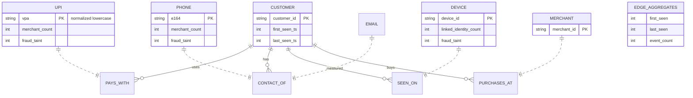

# 04: Data Design

## Storage Layers

| Layer | Local build | Production counterpart |
|-------|-------------|------------------------|
| Identity link graph | `networkx.MultiDiGraph` in-process, persisted as GraphML | Neo4j / Neptune (sharded) |
| Event + verdict store | SQLite (`sentinel.db`) via SQLAlchemy | Aurora PostgreSQL |
| Audit log | SQLite table with append-only trigger | S3 immutable + Glacier |

## Event Schema (input contract)

```json
{
  "event_id": "evt_01HZY...",            // uuid7, idempotency key
  "merchant_id": "mcht_88231",
  "customer_id": "cust_55102",
  "amount_paise": 84900,
  "currency": "INR",
  "upi_vpa": "user@okhdfcbank",
  "phone": "+919812345678",
  "device_id": "dev_9f2a1c",
  "email": "a@example.com",
  "ip": "103.21.58.7",
  "ts": "2026-08-22T14:31:05+05:30",
  "payment_method": "upi",
  "prior_outcome": null                   // "chargeback" | "refund_abuse" | "confirmed_fraud" | null
}
```

All identity fields optional except `event_id`, `merchant_id`, `customer_id`, a ring detection system must handle partial identities gracefully.

## Entity Relationship Model



Node-level derived attributes (`merchant_count`, `linked_identity_count`, `fraud_taint`) are recomputed on write; they are the scorer's primary inputs.

## SQLite Tables (relational store)

```sql
-- events: raw immutable record of every accepted event
events(
  event_id TEXT PRIMARY KEY,
  merchant_id TEXT NOT NULL,
  customer_id TEXT NOT NULL,
  amount_paise INTEGER NOT NULL,
  upi_vpa TEXT, phone TEXT, device_id TEXT, email TEXT, ip TEXT,
  payment_method TEXT, prior_outcome TEXT,
  ts TEXT NOT NULL, ingested_at TEXT NOT NULL,
  label INTEGER           -- ground truth for evaluation only; NULL in serving
)

-- verdicts: one per event, append-only
verdicts(
  verdict_id TEXT PRIMARY KEY,
  event_id TEXT NOT NULL REFERENCES events(event_id),
  score INTEGER NOT NULL,             -- 0-100
  verdict TEXT NOT NULL,              -- ALLOW | REVIEW | BLOCK_REC
  reason_codes TEXT NOT NULL,         -- JSON array
  evidence TEXT NOT NULL,             -- JSON evidence subgraph summary
  features TEXT NOT NULL,             -- JSON feature vector (audit + eval)
  model_version TEXT NOT NULL,
  schema_version TEXT NOT NULL,
  explanation TEXT,                   -- LLM narrative, nullable
  explanation_status TEXT NOT NULL,   -- PENDING | DONE | SKIPPED | FAILED
  created_at TEXT NOT NULL
)

-- graph_snapshots: GraphML blob + hash for reproducibility
graph_snapshots(id INTEGER PRIMARY KEY, run_id TEXT, graphml TEXT, sha256 TEXT, created_at TEXT)
```

## Synthetic Data Generation Plan (the honest-test-set foundation)

**Composition: 900 clean + 100 fraud = 1,000 events** (track-specified ratio), split 60/20/20 train/calibration/test **with ring-aware stratification**: all events of one ring go into exactly one split (prevents leakage, since ring members share entities; this is a real evaluation-design decision most teams miss).

**Clean population (900):** generated from realistic distributions, not uniform noise -
- Zipf-distributed merchants (a few big, many small), amount log-normal (median ₹450, tail to ₹12k), diurnal + weekday seasonality, 15% of clean users legitimately share a device (family), some phones linked to 2 identities (phone upgrade). *Benign overlap is deliberate, it's what makes false positives possible and the FP-cost metric meaningful.*

**Fraud rings (100 events, ~8–12 rings):** injected with the attack model from doc 01 -
- Each ring: 1–3 devices, 4–10 UPI IDs, 2–4 phones, hitting 3–6 merchants in bursts;
- At least one ring with **high sophistication** (low velocity, mimics seasonality) to test recall limits, and we report it even when we miss it;
- `prior_outcome` seeded on ~30% of ring events (chargebacks/refund abuse) to feed taint propagation.

**Generator requirements:** fixed seed (deterministic), generates labels alongside events (labels live only in the events table `label` column and are **never** exposed to the scorer via the serving path, enforced by a separation between serving and evaluation repositories), unit-tested distributions (assert merchant Zipf exponent, assert ring fan-out ranges).

## Data Quality Rules (enforced in validation)

- Phone must normalize to E.164 (`+91` + 10 digits) else stored as `unnormalized_phone` and excluded from phone-linking;
- VPA must match `^[a-z0-9._-]+@[a-z]+$` post-normalization;
- `ts` within ingestion window ± tolerance; future-dated events rejected;
- Amounts in paise (integer), never floats for money.
