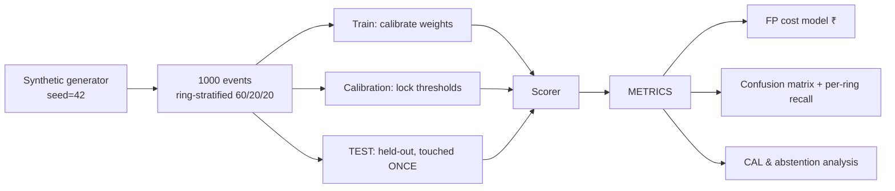

# 05 — ML & Evaluation Design

## Detection Approach: Deterministic Graph Feature Scoring

The scorer computes a feature vector for the identity cluster touched by an event, then applies a **weighted rule ensemble** (weights calibrated on the train split, thresholds calibrated on the calibration split). Weights are simple, published in code, and every score decomposes into per-feature contributions — that's the explainability contract.

### Features (the ring fingerprint)

| Feature | Definition | Signal |
|---------|------------|--------|
| `F1 device_identity_ratio` | distinct identities / distinct devices in the cluster | Normal user 1–3; rings 5–15 |
| `F2 cross_merchant_fanout` | max distinct merchants reached by any single entity (VPA/phone/device) in the cluster | ≥ 3 merchants on one device is anomalous |
| `F3 taint_propagation` | shortest-path distance to any confirmed-fraud node, discounted by hop count (`0.6^hops`) | Post-hoc linking of "burned" rings |
| `F4 velocity` | distinct merchants touched by cluster entities in a sliding 72 h window | Scripted bursts |
| `F5 burn_rotate` | boolean-ish: identity abandoned ≤ 48 h after its first fraud outcome, replaced by a graph neighbor | Classic ring behavior |
| `F6 amount_pattern` | cluster median amount vs. ring-typical band (₹500–2,000, low variance) | Weak alone; contributes little weight — deliberately kept small to avoid punishing normal merchants |
| `F7 new_identity_burst` | fraction of cluster identities created < 7 days | Fresh-account farms |

### Scoring

```
score = clip( Σ wᵢ · norm(Fᵢ), 0, 100 ),  wᵢ calibrated on train split,
        weights fixed & versioned (MODEL_VERSION), sum of wᵢ = 100
```

Thresholds set on the **calibration split** (never the test split) to target a design point of **precision ≥ 0.80 at recall ≥ 0.70**, then locked and run once on the held-out test set. Any post-hoc threshold change is disclosed in the metrics report — this is the honesty protocol.

### Why not a trained classifier (stated tradeoff)

At 1,000 events with heavy entity overlap, logistic regression / GBDT / GNN would (a) overfit shared-entity clusters unless ring-aware CV is used, (b) make the explainability contract much harder, (c) make "measured precision/recall" partly a function of lucky regularization. The deterministic ensemble is auditable, seed-stable, and its features are exactly what a production GNN would consume. **Documented v2:** GNN (GraphSAGE/RGCM) on the same feature schema, trained when ≥ 10⁵ labeled events exist.

## Where the LLM sits (and does not sit)

| Stage | LLM? | Reason |
|-------|------|--------|
| Entity extraction (structured fields) | ❌ regex/deterministic | Faster, free, deterministic |
| Messy free-text backfill (batch only) | ✅ Nova Lite, constrained JSON | Genuine LLM strength |
| Scoring | ❌ **never** | Non-deterministic + unauditable money-adjacent decisions |
| Explanation narrative | ✅ gpt-oss 120B → evidence in, JSON+text out | Genuine LLM strength |

## Evaluation Protocol



**Protocol rules (honesty guarantees):**
1. Ring-stratified split — all events of a ring in one split (no entity leakage).
2. Thresholds locked before touching the test set; single test pass; changes disclosed.
3. Metrics reported with **confidence intervals** (Wilson 95% for precision/recall at n=200 test events).
4. **Per-ring recall** reported, not just per-event — catching 9 of 10 rings matters more than event-level recall; we name the ring we missed and why.
5. Sophisticated-ring subset reported separately — expected lower recall, shown anyway.

## Metrics Specification

| Metric | Definition | Report format |
|--------|------------|---------------|
| Precision | TP / (TP + FP), positive = BLOCK-REC verdict | value + Wilson 95% CI |
| Recall | TP / (TP + FN) at ring level and event level | both, with CI |
| F1 | harmonic mean | value |
| Confusion matrix | ALLOW/REVIEW/BLOCK-REC × clean/fraud | 3×2 table (REVIEW counted as neither TP nor FP — abstention, reported separately) |
| **FP cost (₹)** | see model below | ₹ per 1,000 events + net-savings figure |
| Score calibration | fraction of fraud by score decile | reliability table |

## False-Positive Cost Model (the track's differentiating requirement)

Every false positive has a price; we price it explicitly:

```
FP event cost =
    manual_review_cost        (₹120 ≈ 12 min analyst @ ₹600/h)
  + false_decline_revenue     (P(fulfillment lost) × avg_order_value ₹650 × margin 0.25)
  + customer_lifetime_impact  (P(churn | declined) 0.10 × LTV ₹1,200)
  ≈ ₹120 + ₹81 + ₹12          ≈ ₹213 per FP event (parameters versioned, cited in report)

FN event cost =
    chargeback_amount ₹850 + penalty ₹200 + operational ₹50 ≈ ₹1,100 per FN event

Net impact of deploying the system (per 1,000 events):
    savings = (TP × 1,100) − (FP × 213) − (REVIEW × 120)
```

All parameters are **named constants in one file** (`cost_model.py`-equivalent spec) with sources/assumptions documented — reviewers can disagree with a parameter and recompute; the model structure is the deliverable. The final report shows net ₹ impact at the chosen operating point AND at two alternative thresholds (conservative/aggressive) so the tradeoff curve is visible, not hidden behind one number.

## Reproducibility

- One command: `make evaluate` → regenerates data (seed 42), replays splits, reruns scorer, prints report + writes `evaluation/report.md` + `evaluation/metrics.json`.
- `metrics.json` contains model_version, weights, thresholds, seed, git-style commit of code, full metric set — everything needed to reproduce the number.
