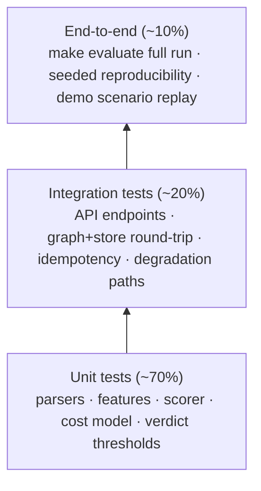

# 09: Testing & Quality Strategy

## Test Pyramid

## Unit Test Targets (core logic ≥ 90% coverage)

| Module | Must-test cases |
|--------|-----------------|
| Entity normalization | E.164 variants (`+91`, `0`-prefix, spaces, `91`-prefix), VPA case/space handling, invalid inputs → `unnormalized_*` path |
| Feature extraction | each F1–F7 on hand-built micro-graphs with known answers (e.g. 1 device + 6 identities ⇒ ratio 6.0) |
| Taint propagation | distance-0, distance-1, distance-3 decay, cycles (no infinite loop), self-taint |
| Scorer | score bounds 0–100, deterministic replay, reason codes fire exactly at thresholds, weights sum invariant |
| Verdict engine | boundary scores 34/35/69/70, `SYS_DEGRADED` forced REVIEW, duplicate event idempotency |
| FP cost model | arithmetic, parameter file loading, alternative threshold sweep output |
| Data generator | seed determinism, ring-stratified split integrity (no entity overlap across splits), distribution assertions (Zipf exponent within tolerance, ring fan-out in spec range) |

## Integration Tests

- API contract tests with `httpx`/`TestClient` against real SQLite + real graph (tmp dirs).
- Bedrock **not** called in CI: LLM client behind an interface; tests use a stub with fixed JSON, plus one opt-in marker (`@pytest.mark.bedrock`) for real-call smoke tests run manually pre-submission.
- Failure injection: store-closed, LLM timeout, malformed LLM JSON → assert documented degradation behavior, never 500.

## Evaluation Harness as a Test

- `make evaluate` is itself gated: asserts precision ≥ 0.80, recall ≥ 0.70 at the locked operating point **on the calibration split**; CI fails if the scorer regresses (the test set is never used as a CI gate, it stays held-out).
- Reproducibility test: two consecutive runs produce identical `metrics.json` (hash comparison).

## CI Gates (GitHub Actions)

1. ruff lint+format clean → 2. mypy strict (core modules) → 3. pytest with coverage ≥ 90% on core → 4. gitleaks (no secrets) → 5. evaluate-on-calibration regression check.

## "What Broke" Log (buildathon deliverable)

A living `docs/what-broke.md`: every genuine failure during development, root cause, and fix, appended in real time, not written retrospectively. This is both an honesty artifact and pitch material (4:00–4:30 slot).
