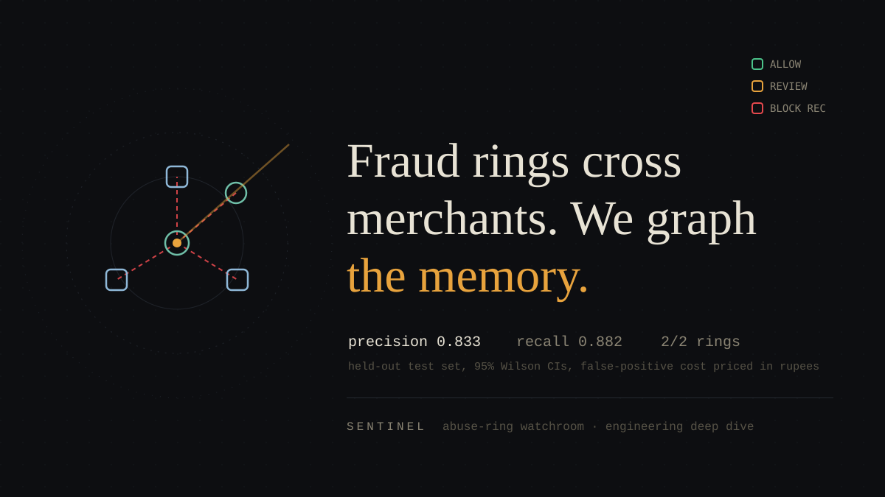
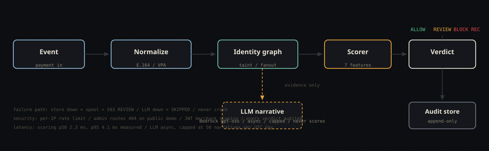

# Sentinel: Catching Fraud Rings That Cross Merchants

*An engineering deep dive into building a defense-only, graph-based fraud detection system with honestly measured metrics, including the false-positive cost, the attacks that beat it, and the baseline model that outperformed it.*

<p align="center"></p>

---

Fraud rings operating across Indian digital payments do not invent new identities. They **recycle** them. The same device fingerprint, the same UPI VPA, the same phone number hit merchant after merchant, extracting value through chargebacks, refund abuse, and promo farming until each merchant individually blocks them. Then the ring moves to the next merchant, where the identity is pristine again.

Every merchant sees a clean first-time customer. The fraud only exists **between** merchants.

This is the blind spot that transaction-level fraud ML cannot fix, no matter how good the model is: each transaction looks legitimate in isolation. The signal is *relational*, identity reuse, velocity across merchants, and cluster geometry. This post is the full engineering story of **Sentinel**, a system we built to close that gap: a cross-merchant identity graph, a deterministic millisecond scorer with an an evidence bundle on every verdict, an LLM that explains but never decides, an evaluation protocol designed to make dishonesty impossible, and an adversarial pack that attacks the system and publishes what got through.

Everything below is real, measured, and reproducible. The repository is public; one command regenerates every number.

<p align="center"></p>

## Table of contents

1. [The problem, quantified](#1-the-problem-quantified)
2. [Why a graph, and why not an LLM](#2-why-a-graph-and-why-not-an-llm)
3. [The data engine: manufacturing honest test data](#3-the-data-engine)
4. [The identity graph](#4-the-identity-graph)
5. [The seven features](#5-the-seven-features)
6. [Scoring, calibration, and the honesty protocol](#6-scoring-calibration-and-the-honesty-protocol)
7. [Results on the held-out set](#7-results)
8. [The rupee cost of a false positive](#8-the-rupee-cost-of-a-false-positive)
9. [We attacked ourselves: the evasion pack](#9-the-evasion-pack)
10. [The LLM layer: where AI sits and where it does not](#10-the-llm-layer)
11. [Production hardening](#11-production-hardening)
12. [What broke](#12-what-broke)
13. [Limitations, honestly](#13-limitations-honestly)
14. [Reproduce it](#14-reproduce-it)

## 1. The problem, quantified

UPI fraud losses in India nearly doubled year over year (₹573 crore in FY23 to ₹1,087 crore in FY24, per Ministry of Finance data cited by PwC), on a rail processing ~22,000 crore transactions a year at ~8,000 TPS average. Refund abuse is now the most-reported attack vector for merchants. The RBI has responded with proposals like mandatory cooling periods for first-time high-value payments, regulation chasing an attack pattern that is fundamentally **relational**.

The economics for a mid-size merchant (~50,000 transactions/month) look like this, using conservative assumptions documented in the repository:

| Loss channel | Monthly exposure |
|---|---|
| Chargebacks from ring activity (120 × ₹850 avg) | ₹1,02,000 |
| Refund abuse (80 × ₹600 avg) | ₹48,000 |
| Chargeback penalties (120 × ₹200) | ₹24,000 |
| Manual review labor (30 hrs × ₹500) | ₹15,000 |
| **Total** | **₹1,89,000/month (~₹22.7 lakh/year)** |

A detector that catches 60% of this activity with controlled false positives saves lakhs per year per merchant. Multiply by thousands of merchants and the blind spot becomes a systemic cost.

## 2. Why a graph, and why not an LLM

The two most common "obvious" solutions both fail here, for instructive reasons.

**Per-transaction ML** (gradient boosting on amount, time, merchant features) cannot see reuse. A ring's events are individually clean: fresh customer accounts, realistic amounts, legitimate merchants. The signal lives in the *join*, this device has now appeared at four merchants in 72 hours. You need state that persists across events, which means you need a graph.

**Sprinkling an LLM on it** fails differently. Asking an LLM to rate risk gives you a verdict that is slow (seconds), expensive (per-event cost), non-deterministic (the same evidence can yield different scores), and unauditable (when a regulator or merchant asks "why was this blocked?", "the model felt it was risky" is not an answer).

So Sentinel draws a hard architectural line, recorded as the project's first Architecture Decision Record:

> **ADR-001: The LLM never scores.** Scoring is a deterministic weighted ensemble over published features. LLMs are used exactly where they are strong: converting evidence into an analyst-facing narrative, off the hot path, cost-capped, with a fallback chain.

The consequences are measurable: scoring runs at **2.3 ms p50 / 4.1 ms p95**, the same evidence always produces the same score, and every verdict decomposes into per-feature contributions that an analyst (or a court) can read. The LLM layer, Amazon Bedrock with a measured fallback chain, writes audit narratives only, asynchronous, with a hard daily cap and every call cost-logged.

## 3. The data engine

You cannot evaluate a fraud detector on data that has no fraud in it, and you cannot use real fraud data at all (privacy, law, and the fact that we do not have it). So the evaluation dataset is **synthetic by design**, but with a critical twist: the generator's job is to make the detector's life *hard*, not easy.

The clean population (900 events) is drawn from realistic distributions:

| Property | Distribution | Why it matters |
|---|---|---|
| Merchant popularity | Power law, top merchant ≈ 29% of traffic | Real merchant traffic is concentrated; uniform data would be a tell |
| Amounts | Log-normal, median ₹444, tail to ₹12,000 | Matches observed e-commerce amounts |
| Temporal | Diurnal + weekday seasonality | Night-time fraud scoring must not be a free feature |
| Device sharing | 15% of events on shared "household" devices | **Benign overlap**: family members genuinely share devices. Without this, any device reuse would be fraud and the false-positive cost would be fictional |
| Benign disputes | ~1.3% of clean events carry chargeback/refund outcomes | So a dispute outcome alone cannot equal guilt |

On top of that, the generator injects 10 fraud rings (100 events) following the attack model:

- **Standard rings (8)**: burst behavior, 3-6 merchants in a 2-5 day window, high identity fan-out, ~30% of events carrying chargeback or refund-abuse outcomes
- **Sophisticated rings (2)**: low-and-slow, spread over 3+ weeks, mimicking clean temporal patterns, designed to be *hard to catch*
- **Burn-and-rotate**: after a fraud outcome, the used VPA is abandoned and the ring rotates to the next one, a real-world pattern
- **Identity sharing**: devices reused across all ring merchants, phones shared in rotating pairs, email alias families

The generator is seeded (42), deterministic to the byte, and the splits are **ring-stratified**: all events of one ring land in exactly one split, enforced by a union-find pass over identity entities with a leakage assertion. Without that, shared ring entities would leak between train and test and every metric would be quietly inflated. This single design decision is the difference between honest numbers and theater.

## 4. The identity graph

The graph is a typed directed multigraph in networkx. A ring, as the detector sees it:

```mermaid
graph LR
    D[device dev_9f] --- C1[customer A]
    D --- C2[customer B]
    D --- C3[customer C]
    C1 --- V1[vpa pay@ybl]
    C2 --- V2[vpa pay2@ybl]
    C1 --- P[phone +91 98xxx]
    C3 --- P
    C1 -.confirmed fraud.-> M1[merchant 1]
    C2 --> M2[merchant 2]
    C3 --> M3[merchant 3]
    style D fill:#15171c,stroke:#e5484d
    style M1 fill:#15171c,stroke:#7a8391
    style M2 fill:#15171c,stroke:#7a8391
    style M3 fill:#15171c,stroke:#7a8391
```



One device, three fresh customers, three merchants, two VPAs, one shared phone: every node clean in isolation, a ring in aggregate.

The graph is a typed directed multigraph in networkx: `customer:*`, `device:*`, `upi:*`, `phone:*`, `email:*`, and `merchant:*` nodes, with edges carrying `first_seen`, `last_seen`, and `event_count`. Two mechanisms make it the detection substrate:

**Taint propagation.** A confirmed fraud outcome (chargeback, refund abuse, confirmed fraud) sets the source customer's taint to 1.0 and spreads it across identity edges at `0.6^hops`, up to 3 hops, never touching merchant nodes. When a *new* identity later links into an already-tainted neighborhood, taint re-spreads to include it. This is how the system catches rings that connect only through a burned neighbor, post-hoc, and impossible to pre-emptively evade.

**Merchants are leaves.** The first implementation's cluster traversal walked *through* merchant nodes, and one popular merchant's hundreds of clean customers flooded every cluster, diluting the ring signal and slowing extraction. The fix became ADR-002: merchants are counted as evidence but never traversed. Identity linkage flows through device/phone/VPA/email edges only. After the fix, ring clusters regained their identity ratio and `cluster_stats` dropped to **0.64 ms p95**.

The graph rebuilds from the audit store on every startup (event sourcing), so a restart loses nothing.

## 5. The seven features

Every event's verdict decomposes into seven published features, computed against the graph state at the event's own timestamp (online semantics: the future is never visible):

| # | Feature | Ring signal | Normalization |
|---|---------|-------------|---------------|
| F1 | `device_identity_ratio` | Distinct identities per device in the cluster; normal users 1-3, rings 5-15 | value / 6 |
| F2 | `cross_merchant_fanout` | Max distinct merchants reached by any single entity | (value − 2) / 4 |
| F3 | `taint_propagation` | Strongest taint in the cluster (0.6^hops from confirmed fraud) | clipped to [0, 1] |
| F4 | `velocity_72h` | Distinct merchants touched by cluster members in 72h | value / 5 |
| F5 | `burn_rotate` | VPA abandoned ≤48h after a fraud outcome, replacement appeared | binary |
| F6 | `amount_pattern` | Event and cluster-mean amounts inside the ₹500-2,000 ring band | 0 / 0.5 / 1 |
| F7 | `new_identity_burst` | Fraction of cluster customers created <7 days ago | clipped to [0, 1] |

F6 is deliberately minor (capped at weight 10 of 100): we do not punish merchants for normal pricing, and the first calibration run proved why the cap is needed (see §12).

## 6. Scoring, calibration, and the honesty protocol

The score is a weighted sum of the normalized features, weights summing to 100, every contribution recorded on the verdict:

```
score = Σ wᵢ · normalize(Fᵢ),  clipped to [0, 100]
```

What makes the numbers meaningful is the **protocol**, not the model:

1. **Weights** are fitted on the train split only, by coordinate ascent maximizing F1 under 5-fold *ring-grouped* cross-validation (folds by ring, mirroring the split-integrity rule).
2. **Thresholds** are locked on the calibration split only: the BLOCK_REC threshold at the smallest score hitting precision ≥ 0.80 with recall ≥ 0.70; the REVIEW threshold at the smallest score with queue precision ≥ 0.25 (a real analyst-triage bar, so the abstention band is meaningful rather than a scale artifact).
3. **The test split is touched exactly once**, after both locks, by a single evaluation pass. The test-set hash is recorded; timings live in a separate file so `metrics.json` is byte-identical across runs, and a test asserts that.

Locked on seed 42: **review at 42, block at 49**, weights dominated by new-identity burst (35), taint (20), and device-identity ratio (13), with amount-pattern capped at 7.

## 7. Results

Held-out test set: 197 events, 17 fraud, evaluated once with the locked model.

| Metric | Value |
|---|---|
| Precision (positive = BLOCK_REC) | **0.833** (95% Wilson CI 0.586-0.946) |
| Recall, event level | **0.882** (95% CI 0.622-0.966) |
| F1 | **0.857** |
| Rings caught | **2 of 2**, including the sophisticated low-and-slow ring |
| Fraud silently passed (ALLOW band) | **0** |
| Confusion | BLOCK: 15 fraud / 3 clean · REVIEW: 2 fraud / 64 clean · ALLOW: 0 fraud / 113 clean |
| Net saving after FP + review cost | **₹38,665 per 1,000 events** |
| Scoring latency | p50 2.3 ms, p95 4.1 ms (design target 20 ms) |

The confidence intervals are wide, 17 fraud events is 17 fraud events, and pretending otherwise would be the first dishonest number in a project about honest numbers. The per-ring view matters more than the event view: catching both rings means the system works at the unit the attacker operates at.

## 8. The rupee cost of a false positive

The track's differentiating requirement, and the number most fraud demos hide, is what a false alarm costs. Every constant is named, sourced, and mirrored in code:

```
FP cost = review labor (12 min × ₹600/h = ₹120)
        + lost fulfillment (P 0.50 × ₹650 AOV × 0.25 margin = ₹81)
        + churn impact (P 0.10 × ₹1,200 LTV = ₹120)        = ₹321 per false positive

FN cost = chargeback ₹850 + penalty ₹200 + ops ₹50            = ₹1,100 per miss
Review cost = ₹120 per flagged event
```

At the locked operating point, per 1,000 events: **gross fraud saved ₹83,756, false positives −₹4,888, review labor −₹40,203 → net ₹38,665**. The sensitivity table in the report shows the same arithmetic at thresholds ±10, because one operating point is a choice, not a truth.

## 9. We attacked ourselves: the evasion pack

A fraud system tested only against cooperative fraud is untested. The repository ships four attacker simulators, evaluation-only, that try to beat the detector:

| Strategy | Technique | Result against locked model |
|---|---|---|
| Benign mimicry | Amounts drawn from the clean distribution | 5% missed entirely, 15% below block |
| Partitioned | Sub-rings below density thresholds, bridged by taint | 0% missed, 11% below block |
| Identity rotation | Fresh device + VPA per event, shared phones | 0% missed, 30% below block |
| **Slow rate** | One event per week, minimal velocity | **90% missed entirely** |

The slow-rate result is published because it is real: the calibrated weights de-emphasized lifetime fan-out, and patient rings exploit that. The fix (a time-windowed fan-out feature) is documented in the roadmap. Retuning weights until the evasion table looked good would have meant tuning on evaluation data, forfeiting the protocol that makes any of the numbers mean anything.

The same honesty applies to the model comparison: logistic regression and gradient boosting trained on the identical features and splits are reported side by side, and **the GBDT wins on F1 (0.909 vs 0.857)**. Rather than hide that, a hardening pass promotes the finding into architecture: the GBDT runs as a **champion/challenger shadow**, its opinion is recorded next to every verdict (96.45% held-out agreement measured), it never decides, and four written criteria (multi-seed superiority, no precision regression, explainability parity, analyst-reviewed soak) gate any promotion.

## 10. The LLM layer

The narrative layer is Amazon Bedrock, verified on day one with bounded probe calls rather than assumptions:

| Model | ID | Constrained JSON | Latency | Role |
|---|---|---|---|---|
| gpt-oss 120B | `openai.gpt-oss-120b-1:0` | prompt-only (fences stripped) | 7.2 s | Primary narrative |
| gpt-oss 20B | `openai.gpt-oss-20b-1:0` | prompt-only | 1.4 s | Fallback 1 |
| GLM-5 | `zai.glm-5` | prompt-only | 0.7 s | Fallback 2 |
| Nova Lite | `amazon.nova-lite-v1:0` | prompt-only | 0.5 s | Extraction assist |
| Llama 3.3 70B | listed, not invocable in-region via base ID |, |, | Rejected on measurement |

Day-one findings that shaped the layer: no Bedrock model honored native `responseFormat` JSON (markdown-fence stripping plus schema validation is mandatory), and the gpt-oss models are reasoning models that return *empty text* under small token budgets (budgets start at 512 and the stop reason is checked before declaring failure). The chain falls through on timeout or malformed output (one bounded retry per model, no retry storms) and ends as `SKIPPED` with the verdict untouched. Every call is cost-logged; the entire build's LLM spend is under **$0.10** against a $20 budget.

On the hosted demo, narratives are pre-generated and served from the audit store; a "generate live" button makes real Bedrock calls through a server-side endpoint capped at 50 per UTC day. The frontend never touches credentials, and the expensive component was never in the interactive request path, so the public demo cannot burn money by construction.

## 11. Production hardening

A hardening pass converted the prototype into an operated system:

- **Load testing**: 178 events/s per worker through the full pipeline (ingest → normalize → graph → features → score) at p50 4.8 ms. A threaded arrival probe holds throughput flat at 183/s while tails explode to p99 346 ms, the measured proof that process sharding, not threads, is the scale path. The [productionization RFC](../15-productionization-rfc.md) derives the 10,000 events/s plan from these numbers: 16-24 workers across 4-6 nodes, a hash-sharded graph tier, and streaming ingest.
- **AuthN/Z**: per-merchant HS256 JWTs. A merchant token can ingest only its own events (403 `MERCHANT_MISMATCH` otherwise) and its queue view filters to its own traffic, the federated-privacy promise enforced at the identity layer. Admin scope is a separate key; JWTs structurally cannot carry it.
- **Observability**: `/metrics` in Prometheus text format (request counters by verdict band, latency histograms, uptime), `X-Request-Id` correlation on every response, and score-distribution drift gauges with a warm-up baseline (drift reads 0 until the baseline window fills (zero by construction, not by accident)).
- **Engines and containers**: multi-stage Dockerfiles and a compose stack for API + console, built and boot-tested by CI on every push; the audit store runs unchanged against Postgres 16 in a CI service container (dialect-gated pragmas and conflict handling).
- **Public-demo mode**: one flag disables the admin surface structurally (404, not 403), arms per-IP rate limiting, and caps live narrative generation.
- **Deployment**: all-AWS kit, App Runner from the repo Dockerfile with a Bedrock instance role (zero keys in env), S3/CloudFront for the console, and a zero-backend static snapshot mode (`make snapshot`) for a click-anywhere demo that costs nothing.

## 12. What broke

Twenty-eight genuine failures are logged in [`what-broke.md`](../what-broke.md), appended in real time with root causes. A representative selection:

| What broke | Root cause | Fix |
|---|---|---|
| First calibration inflated the weakest feature to weight 32 | Coordinate ascent exploited the synthetic amount distribution | Published per-feature weight caps as a design constraint |
| All 100 fraud events landed in the train split | The greedy split filler had lost its count update | Restored; a test now asserts fraud reaches every split |
| One popular merchant flooded every identity cluster | Cluster BFS traversed through merchant nodes | Merchants became non-traversable leaves; p95 dropped to 0.64 ms |
| gpt-oss returned empty text at 128 tokens | Reasoning models spend budget thinking first | ≥512 token budgets; stop reason checked |
| CI failed while local tests passed | Gitignored calibration artifact existed locally, not in CI; later, a lockfile captured the editable install | Self-contained test configs; `pip freeze --exclude-editable` |
| `service.py` silently reverted between edits and commits | OneDrive sync race | Rebuilt as the authoritative file; re-read-before-commit habit recorded |

## 13. The path to production defense grade

The gap from this system to a payment-platform deployment is specific, and each item has a designed landing point:

| Upgrade | What it takes | Designed in |
|---------|---------------|-------------|
| Streaming ingest | Kinesis/Flink operators replace synchronous POST; backpressure becomes queue depth | docs/15 RFC |
| Sharded graph tier | Hash-partitioned entity shards, ~80% local cluster reads | docs/15 RFC |
| GNN scoring at scale | GraphSAGE on this exact feature schema once real labeled data exists; champion/challenger gates promotion | docs/14 |
| Real-label MLOps | Drift monitors feed retraining; champion/challenger automation across seeds | docs/14, /metrics |
| Federated sharing | Verdict exchange across merchants without identity exchange | docs/07, JWT scoping |
| Compliance program | DPDP data protection, PCI scope maintenance, model risk management | docs/07 |
| Red-team program | Continuous evasion testing against production weights | evasion pack, formalized |

## 14. Limitations, honestly

- **Scale**: 178 events/s per worker is a laptop number. Production scale (UPI's ~8,000 TPS) needs the RFC's architecture, built and measured here only at prototype scale.
- **Data**: 1,000 synthetic events validate the *protocol*, not real-world performance. Real labels, drift, and adversary adaptation are the actual hard problems.
- **The champion is beatable**: by the GBDT on F1, and by patient attackers on recall. Both are published, and both are the roadmap.
- **No GNN at n=1,000**: training a graph neural network on this dataset would overfit shared-entity clusters and forfeit explainability. The feature schema is designed to be the GNN's future input; the data volume is not there yet.

## 15. Reproduce it

```bash
git clone https://github.com/Prakhar2025/Sentinel && cd Sentinel
make setup && make check       # 196 tests, 92% coverage, strict mypy
make calibrate && make evaluate  # the numbers in this post, byte-identical
make serve && make console-setup && make console
```

The system recommends; it never acts. Every verdict carries its evidence, every failure degrades loudly, and every number in this post can be regenerated from a fresh clone in minutes.

---

*Built as an independent deep dive into cross-merchant fraud detection. Repository: [github.com/Prakhar2025/Sentinel](https://github.com/Prakhar2025/Sentinel). The design documentation, threat model, runbook, and all 19 engineering documents are in the repository.*
